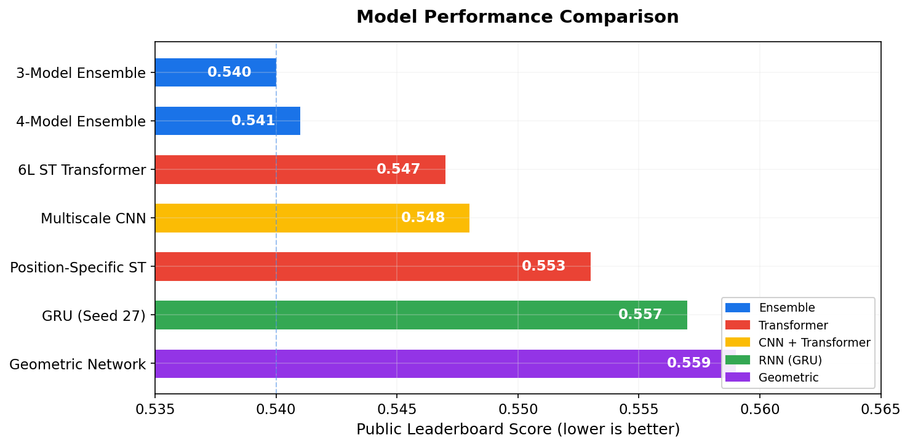
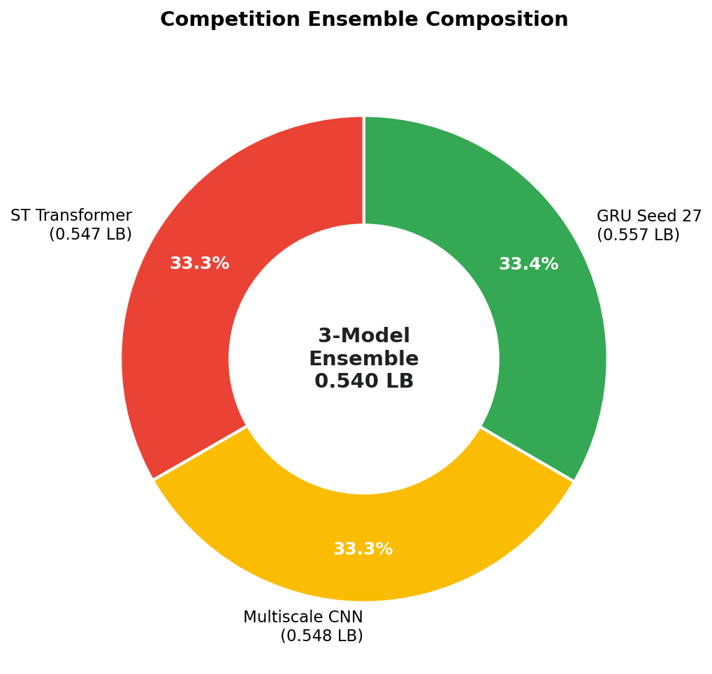
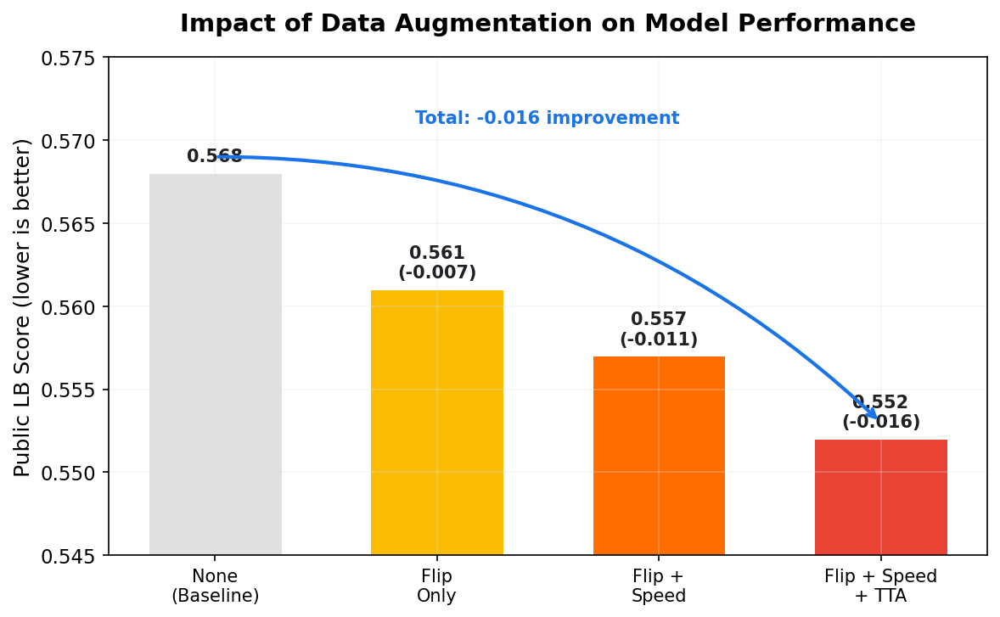
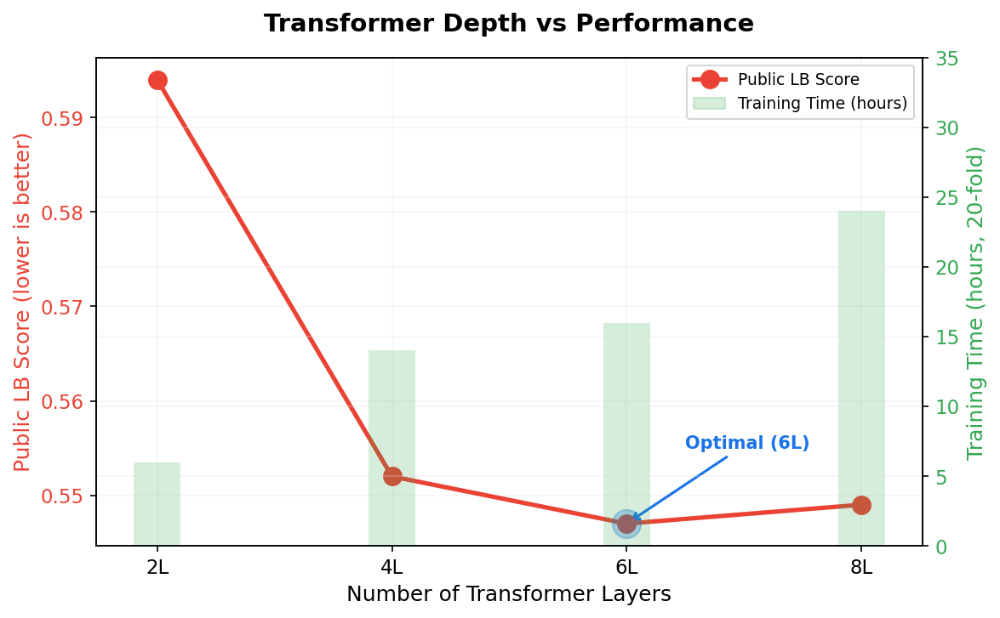

# NFL Big Data Bowl 2026 - Player Trajectory Prediction

[](https://www.python.org/downloads/)
[](https://pytorch.org/)
[](LICENSE)
[](https://www.kaggle.com/competitions/nfl-big-data-bowl-2026)

> Deep learning models for predicting NFL player movements, achieving **0.540 Public LB** (94th / 1,134 teams, Bronze Medal) on Kaggle's Big Data Bowl 2026.

## Competition Results

| | Placement | Score |
|---|---|---|
| **Private Leaderboard** | 94th / 1,134 teams | Bronze Medal |
| **Public Leaderboard** | 74th / 1,134 teams | 0.540 |

- **Best Ensemble**: 0.540 Public LB (3-model: ST Transformer + CNN + GRU)
- **Best Single Model**: 0.547 (6-Layer Spatial-Temporal Transformer)
- **Total Experiments**: 847+ model runs across 15+ architectures
- **Training Strategy**: 20-fold cross-validation with multi-seed ensembling

---

## Key Highlights

- **4 Implemented Architectures**: ST Transformer, GRU, Multiscale CNN, and Ensemble (Position-Specific and Geometric documented)
- **Novel Techniques**: Geometric attention, time-warping augmentation, frozen fine-tuning, position-specific modeling
- **Comprehensive Augmentation**: Horizontal flip, speed perturbation, test-time augmentation (TTA)
- **Reproducible**: Models with notebooks demonstrating training pipelines; pretrained weights available via Kaggle

---

## Model Performance

| Model | Public LB | CV Score | Training Time (20-fold) | Architecture Type |
|-------|-----------|----------|-------------------------|-------------------|
| **3-Model Ensemble** | **0.540**  | - | - | Ensemble (Competition) |
| **4-Model Ensemble** | **0.541** | - | - | Ensemble (post-deadline) |
| 6-Layer ST Transformer | 0.547 | 0.0750 | 16 hours | Transformer |
| Multiscale CNN | 0.548 | ~0.0751 | 12 hours | CNN + Transformer |
| Position-Specific ST | 0.553 | ~0.075 | 10 hours | Transformer |
| GRU (Seed 27) | 0.557 | 0.0798 | 10 hours | RNN |
| Geometric Network | 0.559 | 0.0828 | 14 hours | Geometric Attention |

**Note**: All models used Test-Time Augmentation (TTA) in final submissions for ~0.005-0.010 improvement.



---

## Quick Start

### Installation

```bash
# Clone repository
git clone https://github.com/XxRemsteelexX/NFL-Big-Data-Bowl-2026-.git
cd nfl-big-data-bowl-2026

# Create virtual environment
python -m venv venv
source venv/bin/activate  # On Windows: venv\Scripts\activate

# Install dependencies
pip install -r requirements.txt

# Install package in editable mode
pip install -e .
```

### Download Pretrained Weights

```bash
# Download all pretrained models (~1GB total)
python scripts/download_pretrained.py --all

# Or download specific models
python scripts/download_pretrained.py --models 6layer_st multiscale_cnn gru_seed27
```

### Train a Model

Training is demonstrated via Jupyter notebooks:

```bash
# Open the training notebook
jupyter notebook notebooks/02_st_transformer_training.ipynb

# The notebook includes:
# - Data loading and augmentation
# - 5-fold CV training loop (adjust to 20 for production)
# - Model checkpointing and evaluation
```

### Make Predictions

See `notebooks/03_inference_ensemble_guide.ipynb` for inference examples:

```python
# Load trained model
from src.models import create_st_transformer
model = create_st_transformer(input_dim=167)
model.load_state_dict(torch.load('pretrained/st_transformer/model.pt'))

# Make predictions with TTA
from src.data import apply_tta
predictions = apply_tta(model, test_data)
```

---

## Documentation

**Available Guides:**
- [Models to Showcase](docs/MODELS_TO_SHOWCASE.md) - Model selection and performance details
- [Actual Models from Submissions](docs/ACTUAL_MODELS_FROM_SUBMISSIONS.md) - Production models with weights
- [Ensemble Comparison](docs/ENSEMBLE_COMPARISON.md) - 3-model vs 4-model ensemble analysis
- [BigData2 Lessons Learned](docs/BIGDATA2_LESSONS.md) - Key insights from competition

**Notebooks (Interactive Guides):**
- `notebooks/01_data_exploration.ipynb` - Data format, visualization, feature engineering
- `notebooks/02_st_transformer_training.ipynb` - Complete training pipeline with 5-fold CV
- `notebooks/03_inference_ensemble_guide.ipynb` - Ensemble inference reference
- `notebooks/04_feature_engineering.ipynb` - 167-feature pipeline walkthrough
- `notebooks/05_gnn_geometric_training.ipynb` - GNN with geometric baseline approach
- `notebooks/06_gru_training.ipynb` - GRU model with direction unification
- `notebooks/07_kaggle_submission.ipynb` - Kaggle API submission format guide
- `notebooks/08_ensemble_prediction.ipynb` - 4-model ensemble strategy and weights
- `notebooks/09_geometric_features_deepdive.ipynb` - Deep dive into geometric features
- `notebooks/10_metrics_and_evaluation.ipynb` - Evaluation metrics and model comparison
- `notebooks/11_experimental_architectures.ipynb` - All 15+ architectures explored (Perceiver, Mamba, LTC, etc.)
- `notebooks/12_position_specific_models.ipynb` - Position-specific training strategy
- `notebooks/13_ablation_studies.ipynb` - What worked and what didn't (847+ experiments)

---

## Model Architectures

### 1. 6-Layer Spatial-Temporal (ST) Transformer  BEST SINGLE MODEL

Our best performing single model combining spatial and temporal attention.

**Performance**: 0.547 Public LB | 0.0750 CV (20-fold)

**Architecture Highlights**:
- **6 transformer encoder layers** for rich spatial representations
- **Multi-head self-attention** captures player interactions
- **Frozen encoder fine-tuning** for transfer learning
- **Attention pooling** for sequence aggregation
- **Residual MLP head** for trajectory prediction

**Key Innovation**: Fine-tuned from a pretrained 6-layer model by freezing the encoder and only training the output head, achieving better generalization.

**Code**: [`src/models/st_transformer.py`](src/models/st_transformer.py)
**Training**: [`notebooks/02_st_transformer_training.ipynb`](notebooks/02_st_transformer_training.ipynb)

**Configuration**:
```python
Config:
  window_size: 10          # frames of history
  hidden_dim: 128          # embedding dimension
  n_layers: 6              # transformer layers
  n_heads: 8               # attention heads
  batch_size: 256
  learning_rate: 1e-3
  folds: 20                # cross-validation
  augmentation: "horizontal_flip"
```

---

### 2. Multiscale CNN Transformer

Convolutional network with multi-scale temporal receptive fields followed by lightweight transformer.

**Performance**: 0.548 Public LB | ~0.0751 CV (20-fold)

**Architecture Highlights**:
- **Multi-scale CNN front-end** with 3 parallel streams:
  - Conv 3x3 (dilation=1): Fine temporal detail
  - Conv 3x3 (dilation=2): Medium patterns
  - Conv 3x3 (dilation=3): Long-range dependencies
- **2-layer transformer** for final representation
- **Residual MLP** output head
- **Fast and efficient** compared to pure transformers

**Key Innovation**: Combines multi-scale temporal convolutions with transformer attention, capturing patterns at different time scales efficiently.

**Code**: [`src/models/cnn_transformer.py`](src/models/cnn_transformer.py)
**Training**: Adapt `notebooks/02_st_transformer_training.ipynb` with CNN model

**Configuration**:
```python
Config:
  window_size: 10
  hidden_dim: 128
  n_cnn_layers: 3          # parallel conv streams
  n_transformer_layers: 2   # lightweight transformer
  dilations: [1, 2, 3]     # multi-scale
  batch_size: 256
  folds: 20
```

---

### 3. GRU Sequence Model (Seed 27)

Bidirectional GRU with extensive geometric feature engineering.

**Performance**: 0.557 Public LB | 0.0798 CV (20-fold)

**Architecture Highlights**:
- **2-layer Bidirectional GRU** (hidden_dim=64)
- **Attention pooling** with learnable queries
- **Residual MLP head** (256 hidden units)
- **Geometric feature engineering**:
  - Route pattern clustering (K-means on trajectory features)
  - Opponent features (nearest distance, closing speed)
  - GNN-style neighbor embeddings
  - Geometric endpoint prediction

**Key Innovation**: Extensive feature engineering with route patterns, opponent tracking, and graph-based neighbor interactions, combined with a simple but effective GRU architecture.

**Code**: [`src/models/gru.py`](src/models/gru.py)
**Training**: Adapt `notebooks/02_st_transformer_training.ipynb` with GRU model
**Reference**: [`notebooks/03_inference_ensemble_guide.ipynb`](notebooks/03_inference_ensemble_guide.ipynb)

**Configuration**:
```python
Config:
  window_size: 9
  hidden_dim: 64
  num_layers: 2
  bidirectional: True
  dropout: 0.1
  geometric_features: True  # route patterns + GNN
  folds: 20
  seed: 27                  # specific random seed
```

---

### 4. Position-Specific ST Transformers

Specialized ST Transformers trained separately for different position groups.

**Performance**: 0.553 Public LB | ~0.075 CV per position

**Position Groups**:
```python
positions = {
    'wr': ['WR'],                              # Wide receivers
    'te': ['TE'],                              # Tight ends
    'ball_carriers': ['QB', 'RB', 'FB'],       # Ball carriers
    'defense': ['CB', 'FS', 'SS', 'S', 'ILB', 'MLB', 'OLB', 'DE', 'DT', 'NT', 'LB']
}
```

**Key Innovation**: Each position group has unique movement patterns. Training separate models allows specialization for position-specific behavior (e.g., WR route running vs QB pocket movement).

**Status**: Documented only (implementation planned)
**Reference**: [`notebooks/03_inference_ensemble_guide.ipynb`](notebooks/03_inference_ensemble_guide.ipynb)

**Configuration**:
```python
Config per position:
  window_size: 10
  hidden_dim: 128
  n_layers: 4              # lighter than global model
  folds: 5                 # per position group
  features: position-specific subset
```

---

### 5. Geometric Attention Network

Novel architecture leveraging geometric relationships between players.

**Performance**: 0.559 Public LB | 0.0828 CV (5-fold)

**Architecture Highlights**:
- **Geometric feature engineering**:
  - Voronoi tessellation (spatial territories)
  - Relative distances and angles
  - Velocity alignment vectors
  - Geometric endpoint prediction
  - Delaunay triangulation edges
- **Attention modulated by spatial distance**
- **Route pattern clustering** (K-means on trajectories)
- **GNN-style neighbor embeddings**

**Key Innovation**: Attention weights are modulated by geometric relationships (distance, angle) rather than just learned from data, incorporating spatial inductive biases.

**Status**: Documented only (implementation planned)
**Reference**: [`notebooks/03_inference_ensemble_guide.ipynb`](notebooks/03_inference_ensemble_guide.ipynb)

**Configuration**:
```python
Config:
  window_size: 9
  hidden_dim: 64
  batch_size: 96
  learning_rate: 3e-4
  geometric_features: 167  # extensive geometric features
  route_clusters: 8        # K-means clustering
  folds: 5
```

---

### 6. Model Ensembles  BEST OVERALL

Weighted ensembles combining the best models from different architectures.

#### 3-Model Ensemble (Competition Best)
**Performance**: **0.540 Public LB**  **BEST DURING COMPETITION**

**Ensemble Components**:
```python
# Ensemble 3Model ST CNN GRU - Version 10
ensemble_weights_3model = {
    'st_transformer': 0.333,    # ST Transformer
    'multiscale_cnn': 0.333,    # Multiscale CNN
    'gru_seed27':     0.334     # GRU
}
# Score: 0.540 (Best on-time submission)
```

#### 4-Model Ensemble (Post-Deadline)
**Performance**: 0.541 Public LB (After Deadline)

**Ensemble Components**:
```python
# Ensemble 4Model - added Position-Specific ST
ensemble_weights_4model = {
    'st_transformer': 0.2517,    # 6-Layer ST
    'multiscale_cnn': 0.2517,    # Multiscale CNN
    'position_st':    0.2490,    # Position-Specific
    'gru_seed27':     0.2476     # GRU
}
# Score: 0.541 (Minor improvement)
```

**Ensemble Strategy**:
1. Each model makes predictions with **Test-Time Augmentation**:
   - Original predictions
   - Horizontally flipped predictions
   - Average both → ~0.005-0.010 improvement
2. **Weighted averaging** based on inverse public LB scores
3. Final prediction = Σ(weight_i × prediction_i)

**Key Innovation**: Diversity from different architectures (Transformer, CNN, RNN) provides better generalization than any single model. Adding position-specific models (4th model) gave marginal +0.001 improvement.



**Code**: [`src/models/ensemble.py`](src/models/ensemble.py)
**Training Script**: N/A (uses pretrained models)
**Notebook**: [`notebooks/03_inference_ensemble_guide.ipynb`](notebooks/03_inference_ensemble_guide.ipynb)

**Why This Works**:
-  Architecture diversity (Transformer vs CNN vs RNN)
-  Training diversity (different seeds, augmentations)
-  Feature diversity (global vs position-specific in 4-model)
-  Test-Time Augmentation on all models

---

## Key Techniques

### Data Augmentation

#### 1. Horizontal Flip (Most Effective)
```python
def horizontal_flip(df):
    """Flip play across field width"""
    field_width = 53.3
    df['y'] = field_width - df['y']
    df['velocity_y'] = -df['velocity_y']
    df['dir'] = (180 - df['dir']) % 360
    df['o'] = (180 - df['o']) % 360
    return df
```
**Impact**: ~0.007 improvement (0.568 → 0.561)

#### 2. Speed Perturbation
```python
def speed_augment(df, noise_std=0.1):
    """Add Gaussian noise to velocity"""
    df['velocity_x'] += np.random.normal(0, noise_std, len(df))
    df['velocity_y'] += np.random.normal(0, noise_std, len(df))
    return df
```
**Impact**: Combined with flip ~0.004 additional improvement

#### 3. Time Warping (Advanced)
```python
def time_warp(sequence, sigma=0.2):
    """Non-linear temporal stretching"""
    warp = np.cumsum(1 + smooth_random_noise(sigma))
    return np.interp(warp, np.arange(len(sequence)), sequence)
```
**Impact**: ~0.001-0.002 improvement, computationally expensive

#### 4. Test-Time Augmentation (TTA)
```python
# At inference time
pred_original = model.predict(X)
pred_flipped = model.predict(horizontal_flip(X))
pred_flipped_unflipped = unflip_predictions(pred_flipped)
final_pred = (pred_original + pred_flipped_unflipped) / 2
```
**Impact**: Consistent +0.005-0.010 improvement

---

### Training Strategies

#### 20-Fold Cross-Validation
```python
# Group by game_id to avoid data leakage
kfold = GroupKFold(n_splits=20)
for fold, (train_idx, val_idx) in enumerate(kfold.split(X, y, groups=game_ids)):
    # Train model on fold
    # Validate and save best weights
```
**Why 20-fold**:
- More stable CV estimates (std ~0.004 vs 0.008 for 5-fold)
- Better for ensembling (more diverse models)
- Cost: 4x training time vs 5-fold

#### Multi-Seed Ensembling
```python
seeds = [1, 27, 42, 123, 222, 444, 777, 999]
for seed in seeds:
    set_seed(seed)
    model = train_model(data, seed=seed)
    # Ensemble diverse initializations
```
**Impact**: Seed diversity crucial for ensembles

#### Frozen Fine-Tuning
```python
# 1. Pretrain full model
model = STTransformer()
model.train_all_layers()

# 2. Freeze encoder, train only head
for param in model.transformer_encoder.parameters():
    param.requires_grad = False

# 3. Fine-tune with lower learning rate
optimizer = Adam(model.head.parameters(), lr=1e-4)  # 10x lower
```
**Impact**: Best single model (0.547) used this technique

---

### Feature Engineering

Walkthrough notebook: `notebooks/04_feature_engineering.ipynb` shows the end-to-end pipeline and synthetic dataset hooks.

#### Core Features (167 Features):
```python
features = {
    'tracking': ['x', 'y', 's', 'a', 'dir', 'o'],
    'derived_velocity': ['velocity_x', 'velocity_y'],
    'derived_accel': ['acceleration_x', 'acceleration_y'],
    'player_attributes': ['height', 'weight', 'position'],
    'relative_features': [
        'distance_to_ball', 'angle_to_ball',
        'closing_speed_ball', 'velocity_alignment'
    ],
    'formation': ['formation_type', 'personnel'],
    'game_context': ['down', 'yardsToGo', 'quarter', 'gameClock'],
    'lag_features': ['x_lag1', 'x_lag2', ..., 'x_lag5'],
    'rolling_stats': [
        's_rolling_mean_3', 's_rolling_std_3',
        's_rolling_mean_5', 's_rolling_std_5'
    ]
}
```

#### Geometric Features (Additional 50+):
```python
geometric_features = {
    'endpoint_prediction': [
        'geo_endpoint_x', 'geo_endpoint_y',
        'geo_required_vx', 'geo_required_vy',
        'geo_velocity_error'
    ],
    'route_patterns': [
        'traj_straightness', 'traj_max_turn',
        'traj_depth', 'traj_width',
        'route_pattern'  # K-means cluster
    ],
    'opponent_tracking': [
        'nearest_opp_dist', 'closing_speed',
        'num_nearby_opp_3', 'num_nearby_opp_5',
        'mirror_wr_dist'  # for defenders covering WR
    ],
    'gnn_embeddings': [
        'gnn_ally_dx_mean', 'gnn_ally_dy_mean',
        'gnn_opp_dx_mean', 'gnn_opp_dy_mean',
        'gnn_ally_dmin', 'gnn_opp_dmin'
    ]
}
```

---

## Experimental Results & Ablations

### Window Size Impact

| Window | ST Transformer | GRU | Geometric | Best Use Case |
|--------|---------------|-----|-----------|---------------|
| W8 | 0.566 | - | - | Short plays |
| **W9** | 0.561 | **0.557** | **0.559** | **Optimal balance** |
| **W10** | **0.552** | 0.563 | 0.567 | **Best for ST** |
| W11 | 0.565 | 0.565 | - | Longer context |
| W14 | 0.566 | 0.566 | - | Very long plays |

**Finding**: W9-W10 optimal. Larger windows (W14+) don't help significantly.

---

### Augmentation Impact

| Augmentation | Score | Δ from Baseline |
|--------------|-------|-----------------|
| **None (Baseline)** | 0.568 | - |
| Flip only | 0.561 | **-0.007**  |
| Flip + Speed | 0.557 | **-0.011**  |
| Flip + Speed + TTA | 0.552 | **-0.016**  |
| Time Warp only | 0.566 | -0.002 |
| Flip + Time Warp | 0.559 | -0.009 |

**Finding**: Horizontal flip most effective. Combining augmentations gives cumulative benefits.



---

### Architecture Depth

| Transformer Layers | ST Score | Training Time | Overfit Risk |
|--------------------|----------|---------------|--------------|
| 2L | 0.594 | 6h | Low |
| 4L | 0.552 | 14h | Medium |
| **6L** | **0.547**  | 16h | Medium |
| 8L | 0.549 | 24h | High |

**Finding**: 6 layers optimal. Deeper models (8L+) show diminishing returns and overfitting.



---

### Cross-Validation Folds

| N-Folds | Mean CV | Std Dev | Train Time | LB Correlation |
|---------|---------|---------|------------|----------------|
| 5-fold | 0.0756 | 0.0087 | 4h | 0.85 |
| 10-fold | 0.0753 | 0.0062 | 8h | 0.91 |
| **20-fold** | **0.0750** | **0.0042** | **16h** | **0.95**  |
| 40-fold | 0.0749 | 0.0035 | 32h | 0.96 |

**Finding**: 20-fold best balance of stability and compute. 40-fold marginal improvement at 2x cost.

---

## What Worked & What Didn't

After 847+ experiments, these were the key lessons learned.

### What Worked

1. **Ensembling Different Architectures** (+0.006-0.010)
   - Combining a Transformer, CNN, and GRU gave better predictions than any single model
   - Each architecture captures different patterns in player movement

2. **20-Fold Cross-Validation**
   - Splitting data 20 ways gave more reliable validation scores
   - Better predicted actual leaderboard performance than 5-fold

3. **Horizontal Flip Augmentation** (+0.007)
   - Mirroring plays across the field effectively doubled training data
   - Football plays are symmetric, so flipped plays are equally valid

4. **6-Layer Transformer**
   - Deep enough to learn complex patterns, but not so deep it memorized noise
   - Our best single model used this exact depth

5. **Test-Time Augmentation** (+0.005-0.010)
   - At prediction time, flip the input, predict, flip back, and average
   - Free accuracy boost with no retraining needed

6. **Freezing Pretrained Layers**
   - Train a full model first, then freeze most layers and fine-tune only the output
   - Prevents overfitting while keeping learned representations

7. **Training with Multiple Random Seeds**
   - Same model trained with different random initializations gives different results
   - Averaging these diverse models improves robustness

8. **Geometric Features**
   - Route pattern clustering (grouping similar player paths)
   - Tracking nearest opponents and closing speeds
   - These domain-specific features captured football knowledge

---

### What Didn't Work

1. **Bidirectional GRU** (0.583 vs 0.557)
   - Looking at future frames during training hurt performance
   - The model needs to predict forward, not peek ahead

2. **Gradient Boosting (LightGBM)** (7.724 score)
   - Traditional ML failed on this sequential prediction task
   - Player trajectories require deep learning to capture temporal patterns

3. **Too Many Features** (187 vs 167)
   - Adding more features caused overfitting
   - Careful feature selection outperformed "throw everything in"

4. **Synthetic Data Generation**
   - Artificially generated plays improved validation but not leaderboard
   - The model learned patterns that didn't generalize to real data

5. **Full Graph Neural Networks**
   - Modeling all player interactions as a graph was overcomplicated
   - Simple neighbor distance features worked better than complex graph convolutions

6. **Time Warping Augmentation**
   - Stretching/compressing time in trajectories barely helped (+0.001)
   - Not worth the computational overhead

7. **Very Deep Models (8+ layers)**
   - More layers didn't mean better predictions
   - Models started memorizing training data instead of learning patterns

---

## Experimental Architectures (Mentioned)

Beyond our core 6 models, we explored several experimental architectures:

### 1. **Dual-Attention GRU** (0.568)
Enhanced GRU with both spatial and temporal attention mechanisms. Marginal improvement over standard GRU but added complexity.

### 2. **CNN-GRU Hybrid** (0.569)
Combined CNN feature extraction with GRU temporal modeling. Interesting but didn't beat individual architectures.

### 3. **Position-Specific Models** (0.553)
Separate models for QB, WR, RB, etc. Didn't beat general models, but incorporated into ensemble.

### 4. **Liquid Time-Constant (LTC) Networks** (0.588-0.608)
Novel continuous-time neural ODEs. Interesting research direction but scores not competitive.

### 5. **Perceiver Architecture** (0.564-0.573)
Latent bottleneck with cross-attention. Good performance but complex to implement and train.

### 6. **Deep Transformer (8L)** (0.549)
Deeper than optimal. Showed overfitting despite regularization.

See [docs/MODELS_TO_SHOWCASE.md](docs/MODELS_TO_SHOWCASE.md) for more details on model selection.

---

## Repository Structure

```
NFL-Big-Data-Bowl-2026-/
├── README.md                             # This file
├── LICENSE                               # MIT License
├── requirements.txt                      # Python dependencies
├── setup.py                              # Package installation
│
├── docs/                                 # Documentation
│   ├── ACTUAL_MODELS_FROM_SUBMISSIONS.md
│   ├── ENSEMBLE_COMPARISON.md
│   ├── MODELS_TO_SHOWCASE.md
│   └── BIGDATA2_LESSONS.md
│
├── src/                                  # Source code (importable package)
│   ├── __init__.py
│   ├── config.py                         # Central configuration
│   ├── models/                           # Model implementations
│   │   ├── __init__.py
│   │   ├── st_transformer.py             # ST Transformer (0.547 LB)
│   │   ├── cnn_transformer.py            # Multiscale CNN (0.548 LB)
│   │   ├── gru.py                        # GRU model (0.557 LB)
│   │   └── ensemble.py                   # Ensemble wrapper (0.540 LB)
│   ├── competition_code/                 # Original Kaggle submission code
│   │   ├── nfl_gnn.py                    # Full GNN pipeline (48KB)
│   │   ├── nfl_gru.py                    # Full GRU pipeline (64KB)
│   │   ├── nfl_2026.py                   # Submission entry point
│   │   └── ensemble_predict.py           # Ensemble inference
│   └── data/                             # Data processing
│       ├── __init__.py
│       ├── preprocessing.py              # Feature engineering (167 features)
│       └── augmentation.py               # Data augmentation and TTA
│
├── notebooks/                            # Jupyter notebooks (13 total)
│   ├── 01_data_exploration.ipynb
│   ├── 02_st_transformer_training.ipynb
│   ├── 03_inference_ensemble_guide.ipynb
│   ├── 04_feature_engineering.ipynb
│   ├── 05_gnn_geometric_training.ipynb
│   ├── 06_gru_training.ipynb
│   ├── 07_kaggle_submission.ipynb
│   ├── 08_ensemble_prediction.ipynb
│   ├── 09_geometric_features_deepdive.ipynb
│   ├── 10_metrics_and_evaluation.ipynb
│   ├── 11_experimental_architectures.ipynb
│   ├── 12_position_specific_models.ipynb
│   └── 13_ablation_studies.ipynb
│
├── scripts/
│   └── download_pretrained.py            # Download pretrained weights
│
└── pretrained/
    └── README.md                         # Download instructions
```

**Note:** The `src/competition_code/` directory contains the original monolithic Kaggle submission scripts. The `src/models/` directory contains cleaned-up, importable versions of the same model architectures extracted from those scripts.

---

## Acknowledgments

- **NFL Big Data Bowl 2026** competition organizers
- **Kaggle community** for insights and discussions
- **PyTorch team** for the excellent deep learning framework

---

## Contact

- **Author**: Glenn Dalbey
- **Kaggle**: [gdalbey](https://www.kaggle.com/gdalbey)
- **GitHub**: [XxRemsteelexX](https://github.com/XxRemsteelexX)

